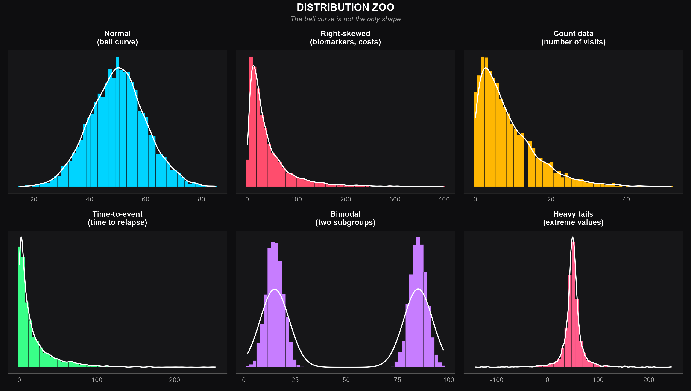
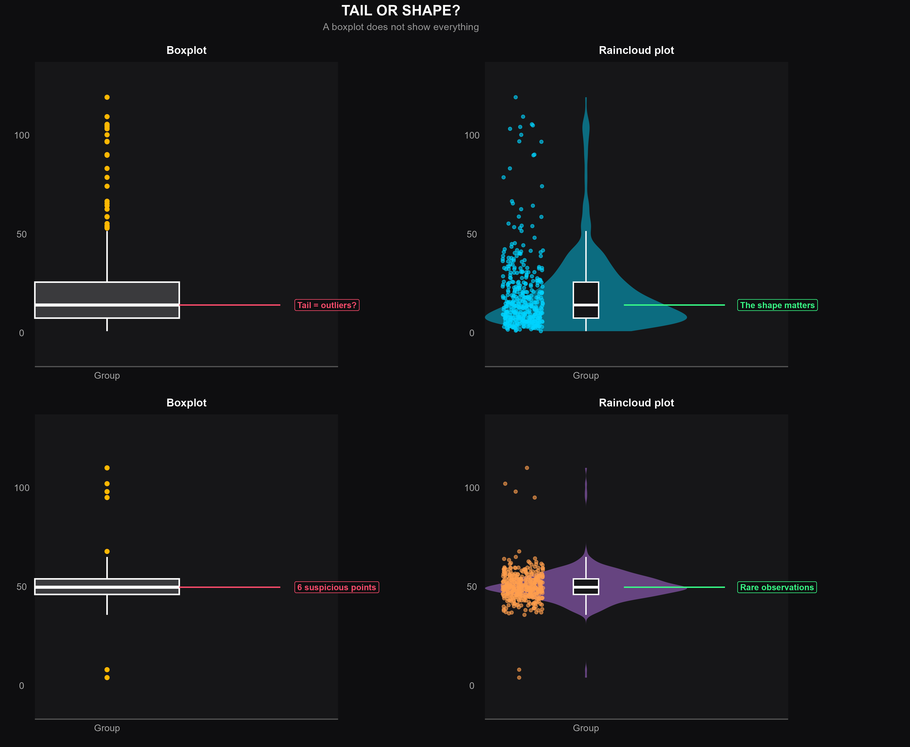

# Distribution Zoo: Real-World Data Rarely Look Perfectly Normal

Statistics courses almost always start with the normal distribution — the
symmetric, well-behaved "bell curve." In real biomedical, clinical, and
business data, that shape is the exception rather than the rule.

This repo contains the R code behind a LinkedIn post exploring:

- The "zoo" of distribution shapes actually seen in practice (right-skewed,
  count data, time-to-event, bimodal, heavy-tailed)
- Why a classic boxplot can hide exactly the structure that matters most
  (skewness, subgroups, true outliers) behind five innocent-looking numbers
- What a **raincloud plot** (violin + boxplot + raw jittered points) reveals
  that a boxplot alone cannot
- A practical decision guide: what to check and which method fits each
  data shape

## Preview

### Distribution zoo


### Boxplot vs. raincloud: tail or shape?


> Note: the two PNGs above are preview renders. Running
> `R/distribution_zoo_boxplot.R` reproduces the same charts directly from
> the source data with `ggplot2` + `patchwork`.

## What's inside

```
distribution-zoo-boxplot/
├── R/
│   └── distribution_zoo_boxplot.R   # full, self-contained script
├── outputs/
│   ├── distribution_zoo_dark.png
│   ├── boxplot_vs_raincloud_dark.png
│   └── distribution_guidance.csv    # decision-guide table (Part 3 of the script)
└── README.md
```

## Running it

Requires `ggplot2` and `patchwork`:

```r
install.packages(c("ggplot2", "patchwork"))
source("R/distribution_zoo_boxplot.R")
```

The script is organized in three parts:

1. **Distribution zoo** — simulates six data shapes (normal, right-skewed,
   count, time-to-event, bimodal, heavy-tailed) and plots them as a 3×2
   grid of density histograms.
2. **Boxplot vs. raincloud** — simulates (a) cleanly skewed data and
   (b) data with a handful of genuine extreme observations, then shows
   both as a plain boxplot and as a raincloud plot side by side. The point:
   a boxplot's "points beyond the whiskers" can mean either a normal tail
   of a skewed distribution or a real anomaly — and a boxplot alone can't
   tell you which.
3. **Guidance table** — a quick-reference table connecting each
   distribution shape to what to check and which modeling approach
   typically fits (log transform, Gamma/Poisson/Negative Binomial GLM,
   survival analysis, robust methods, etc.).

## Why this matters for real analysis

None of this is about forcing data to "look normal." The goal is to:

1. Look at the raw data first (histogram, density, boxplot, raw points)
2. Identify the outcome type (continuous, count, proportion, time-to-event)
3. State the actual research question
4. Choose a method that matches the data, the question, and the study design
5. Check robustness (diagnostics, sensitivity analysis, bootstrap)

Normality is not a prerequisite to satisfy — it's one clue, among several,
about which method fits.

---

*Part of an ongoing biostatistics portfolio — see profile for related
projects on survival analysis and NHANES-based epidemiological modeling.*
